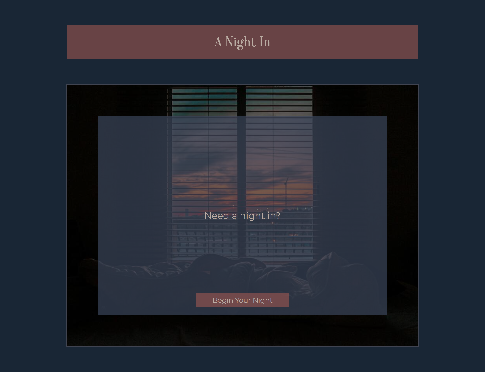
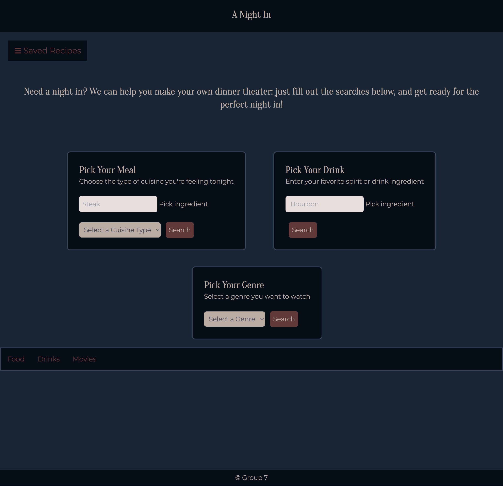
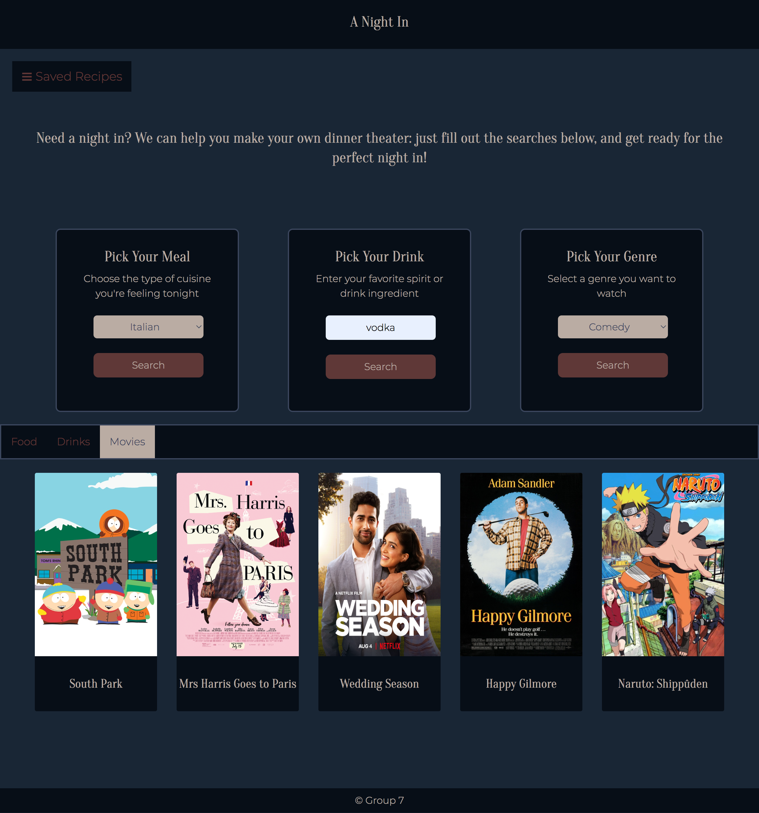

# A-Night-In

## Description

- We wanted to build a site where searching for ideas for a night in would be fun and more focused than doing numerous searches in different browser windows for food, drinks, and entertainment. 
- We built this site to see what we could achieve in accessing recipe and entertainment APIs within a single site. We wanted to see if we could save different kinds of recipes in one place, and we wanted to see if we could turn data from API searches into dynamic content that fit the vibe of our website.
- Our website solves the problem of having scattered searches for drinks, food, and film. It enables the user to find inspiration and easily browse random recipes to see if they see something they hadn't thought of before. 
- We learned a lot about the flow of working together on one project through our local computers and sharing on Github through our main and individual branches.  We learned a lot about the techniques involved in fetching API data, and how to turn it into dynamic information on the DOM. We also learned a lot more about how to use and access data we store in localStorage in the browswer.  


## User Story

```
AS A person ready for dinner and relaxation
I WANT to find food and beverage recipes, and a movie to watch while I relax and eat
SO THAT I can have an enjoyable night in

```

## Acceptance Criteria 

```
GIVEN I need a food and beverage recipe, and a movie to watch
WHEN I click the button to begin the night
THEN I am redirected to a series of search forms where I select what criteria to include in result
WHEN asked for meal criteria
THEN I select what cuisine type I want and submit search
WHEN search is submitted 
THEN I am given a recipe that includes the image and name of meal, an ingredient list, the recipe source and website, and a button to save recipe
WHEN I save the recipe
THEN the recipe is saved to local storage and a droppable side menu
When I click on a meal from my saved recipes
THEN I am redirected to the recipe's website
WHEN asked for beverage criteria
THEN I enter what alcoholic ingredient I want and submit search
WHEN search is submitted 
THEN I am given a recipe that includes the image and name of drink, an ingredient list, the recipe source and website, and a button to save recipe
WHEN I save the recipe
THEN the recipe is saved to local storage and a droppable side menu
WHEN asked for movie criteria
THEN I select what genre I want to watch and submit search
WHEN search is submitted 
THEN I am presented with multiple results that include the movie poster, rating, and plot
```

## Usage

The user would be directed to the homepage where they can decide to continue and create their "Night In". After, the user is directed to the main page where they can select a cuisine for a food recipe, a drink ingredient for a drink recipe and a genre which pops up five random movies/tv shows in that genre. If you click on the save recipe, then the recipes are saved to local storage and in the dropppable side menu.









Deployed Site: https://dhoffman03.github.io/A-Night-In/
GitHub Repo: https://github.com/dhoffman03/A-Night-In

## Credits

Thank you everyone in Group 7!!

[Dymond Hoffman](https://github.com/dhoffman03)
[Reed Meher](https://github.com/archonology)
[Gia Tran](https://github.com/gt1222)


